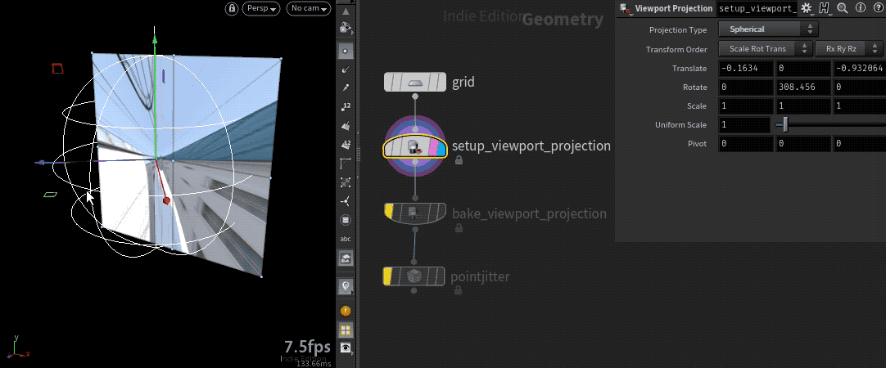

# Houdini Viewport Projection Shader


[A custom viewport shader](https://www.sidefx.com/docs/houdini/shade/glsl.html) for Houdini that supports various types of texture projection without baking @uv attribute. Since the conventional UV mapping computes texture coordinates per vertex and interpolates them linearly along the surface, we need to subdivide meshes to avoid texture looking wobbly in some types of projection such as spherical mapping. Contrarily, this shader computes texture coordinates in the fragment level so we can use simple mesh as it is. It can be useful for image-based modeling. In addition, it supports baking the projection to points so we can displace mesh just like UV mapped one.

Developed by [Baku Hashimoto](https://baku89.com)

## Projection Modes

### Parallel


### Spherical



### Camera


## Usage


1. Download the repository and install HDAs to the running Houdini.
2. Prepare a material that the custom viewport shader applied to.
   1. Create a material builder in either MAT or SHOP context.
   2. Open Edit Parameter Interface from the material's parameter view, then click Render Properties tab.
   3. Add Diffuse Texture (`ogl_tex#`) and GLSL Shader (`ogl_glsl_shader`) to the material's parameters.
   4. Set GLSL Shader to the path to `advanced_viewport_shader.prog` in the downloaded repository folder.
   5. Set any image the diffuse texture.
3. Append Setup Viewport Projection to the SOP tree then set the projection type to an option other than UV.
4. When you want to bake the projection, just append Bake Viewport Projection SOP.

Even though you could enable the shader in the viewport, you still need to setup a material for render engine what you use.

The below table shows the custom attributes added by Viewport Projection SOPs. You can manually configure the shader nodes so that the output image looks exactly same as the viewport preview.

| Class      | Attribute                    | Usage                                                                                         |
| ---------- | ---------------------------- | --------------------------------------------------------------------------------------------- |
| **Detail** | projection (float)           | Specifies projection type by integer<br>0 = UV<br>1 = Parallel<br>2 = Spherical<br>3 = Camera |
|            | projection_x (vec3)          | X-axis column of projection transform matrix                                                  |
|            | projection_y (vec3)          | Y-axis                                                                                        |
|            | projection_z (vec3)          | Z-axis                                                                                        |
|            | projection_t (vec3)          | translation column                                                                            |
|            | projection_use_baked (float) | 0 = Computes texture coord with using @P<br> 1 = Use baked projection                         |
| Point      | projection_pos (vec3)        | Points' coordinates in the projection space                                                   |

For your reference, below pseudo GLSL code shows how to compute UVs.

```glsl
/*** Vertex Shader ***/

in int projection;
in vec3 projection_x;
in vec3 projection_y;
in vec3 projection_z;
in vec3 projection_t;
in int projection_use_baked;
in vec3 projection_pos;

out vec3 vsPos;

void main() {
	mat4 projection_xform = mat4(
			vec4(projection_x, 0.0),
			vec4(projection_y, 0.0),
			vec4(projection_z, 0.0),
			vec4(projection_t, 1.0)
	);

	vec4 pos = vec4(P, 1.0);

	if (projection == 3) { // Camera Projection
		pos = glH_ObjectMatrix * pos;
	}

	pos = projection_xform * pos;

	vsPos = projection_use_baked == 1.0
		? projection_pos
		: pos.xyz;
}

/*** Fragment Shader ***/
in vec3 vsPos;

out vec4 fragColor;

void main() {
	// read in texture maps
	vec2 uv;
	if (fsIn.projection == 1) {
		// Parallel
		uv = rest.xy / 2.0 + 0.5;
	} else if (fsIn.projection == 2) {
		// Spherical
		uv = vec2(
			atan2(rest.z, rest.x) / PI / 2.0 + 0.5,
			atan2(rest.y, length(rest.xz)) / PI + 0.5
		);
	} else if (fsIn.projection == 3) {
		// Camera
		uv = rest.xy / rest.z / -2.0 + 0.5;
	}

	fragColor = texture(tex, uv);
}


```

## Known Issues

- Very slow on macOS Big Sur (w/ 18.5.408)

## License

The MIT License (MIT)

Copyright (c) 2021 Baku Hashimoto

Permission is hereby granted, free of charge, to any person obtaining a copy of this software and associated documentation files (the "Software"), to deal in the Software without restriction, including without limitation the rights to use, copy, modify, merge, publish, distribute, sublicense, and/or sell copies of the Software, and to permit persons to whom the Software is furnished to do so, subject to the following conditions:

The above copyright notice and this permission notice shall be included in all copies or substantial portions of the Software.

THE SOFTWARE IS PROVIDED "AS IS", WITHOUT WARRANTY OF ANY KIND, EXPRESS OR IMPLIED, INCLUDING BUT NOT LIMITED TO THE WARRANTIES OF MERCHANTABILITY, FITNESS FOR A PARTICULAR PURPOSE AND NONINFRINGEMENT. IN NO EVENT SHALL THE AUTHORS OR COPYRIGHT HOLDERS BE LIABLE FOR ANY CLAIM, DAMAGES OR OTHER LIABILITY, WHETHER IN AN ACTION OF CONTRACT, TORT OR OTHERWISE, ARISING FROM, OUT OF OR IN CONNECTION WITH THE SOFTWARE OR THE USE OR OTHER DEALINGS IN THE SOFTWARE.
